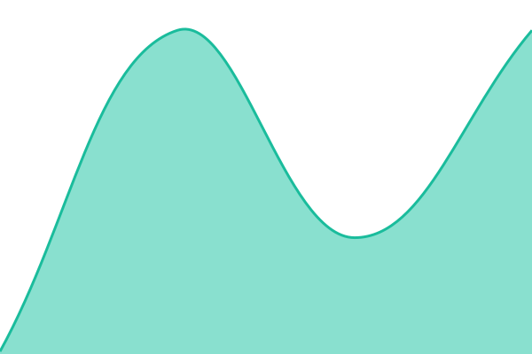
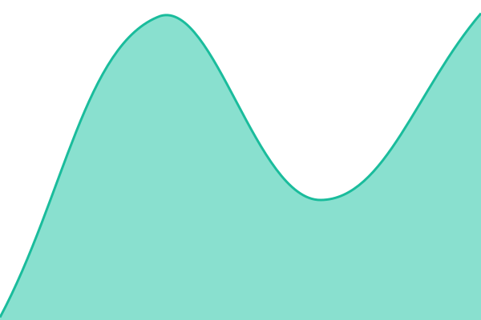

# [📈 Live Status](https://nudgebee.github.io/status): <!--live status--> **🟩 All systems operational**

This repository contains the open-source uptime monitor and status page for [Nudgebee](https://nudgebee.github.io/status), powered by [Upptime](https://github.com/upptime/upptime).

With [Upptime](https://upptime.js.org), you can get your own unlimited and free uptime monitor and status page, powered entirely by a GitHub repository. We use [Issues](https://github.com/nudgebee/status/issues) as incident reports, [Actions](https://github.com/nudgebee/status/actions) as uptime monitors, and [Pages](https://nudgebee.github.io/status) for the status page.

<!--start: status pages-->
<!-- This summary is generated by Upptime (https://github.com/upptime/upptime) -->
<!-- Do not edit this manually, your changes will be overwritten -->
<!-- prettier-ignore -->
| URL | Status | History | Response Time | Uptime |
| --- | ------ | ------- | ------------- | ------ |
|  [App](https://dev.nudgebee.pollux.in/status) | 🟩 Up | [app.yml](https://github.com/nudgebee/status/commits/HEAD/history/app.yml) | 

 214ms
     
 | 

<a href="https://status.dev.nudgebee.pollux.in/history/app">100.00%</a>
    

|  [Docs](https://docs.dev.nudgebee.pollux.in) | 🟩 Up | [docs.yml](https://github.com/nudgebee/status/commits/HEAD/history/docs.yml) | 

 180ms
     
 | 

<a href="https://status.dev.nudgebee.pollux.in/history/docs">100.00%</a>
    

|  [App · Automation](https://dev.nudgebee.pollux.in/api/public/status?component=automation) | 🟩 Up | [app-automation.yml](https://github.com/nudgebee/status/commits/HEAD/history/app-automation.yml) | 

 117ms
     
 | 

<a href="https://status.dev.nudgebee.pollux.in/history/app-automation">100.00%</a>
    

|  [App · Nubi](https://dev.nudgebee.pollux.in/api/public/status?component=ai) | 🟩 Up | [app-nubi.yml](https://github.com/nudgebee/status/commits/HEAD/history/app-nubi.yml) | 

 130ms
     
 | 

<a href="https://status.dev.nudgebee.pollux.in/history/app-nubi">100.00%</a>
    

|  [App · Troubleshooting](https://dev.nudgebee.pollux.in/api/public/status?component=api,ingest) | 🟩 Up | [app-troubleshooting.yml](https://github.com/nudgebee/status/commits/HEAD/history/app-troubleshooting.yml) | 

 122ms
     
 | 

<a href="https://status.dev.nudgebee.pollux.in/history/app-troubleshooting">100.00%</a>
    

|  [App · Account onboarding](https://dev.nudgebee.pollux.in/api/public/status?component=api,notifications) | 🟩 Up | [app-account-onboarding.yml](https://github.com/nudgebee/status/commits/HEAD/history/app-account-onboarding.yml) | 

 114ms
     
 | 

<a href="https://status.dev.nudgebee.pollux.in/history/app-account-onboarding">100.00%</a>
    

|  [App · Optimisation](https://dev.nudgebee.pollux.in/api/public/status?component=api) | 🟩 Up | [app-optimisation.yml](https://github.com/nudgebee/status/commits/HEAD/history/app-optimisation.yml) | 

 114ms
     
 | 

<a href="https://status.dev.nudgebee.pollux.in/history/app-optimisation">100.00%</a>
    

|  [Relay Gateway](https://relay.dev.nudgebee.pollux.in/status) | 🟩 Up | [relay-gateway.yml](https://github.com/nudgebee/status/commits/HEAD/history/relay-gateway.yml) | 

 159ms
     
 | 

<a href="https://status.dev.nudgebee.pollux.in/history/relay-gateway">100.00%</a>
    

|  [Collector Gateway](https://collector.dev.nudgebee.pollux.in/health) | 🟩 Up | [collector-gateway.yml](https://github.com/nudgebee/status/commits/HEAD/history/collector-gateway.yml) | 

 195ms
     
 | 

<a href="https://status.dev.nudgebee.pollux.in/history/collector-gateway">100.00%</a>
    

|  [LLM Gateway](https://llm-gateway.dev.nudgebee.pollux.in/health) | 🟩 Up | [llm-gateway.yml](https://github.com/nudgebee/status/commits/HEAD/history/llm-gateway.yml) | 

 135ms
     
 | 

<a href="https://status.dev.nudgebee.pollux.in/history/llm-gateway">100.00%</a>
    

<!--end: status pages-->

[**Visit our status website →**](https://nudgebee.github.io/status)

## 📄 License

- Powered by: [Upptime](https://github.com/upptime/upptime)
- Code: [MIT](./LICENSE) © [Anand Chowdhary](https://anandchowdhary.com)
- Data in the `./history` directory: [Open Database License](https://opendatacommons.org/licenses/odbl/1-0/)
